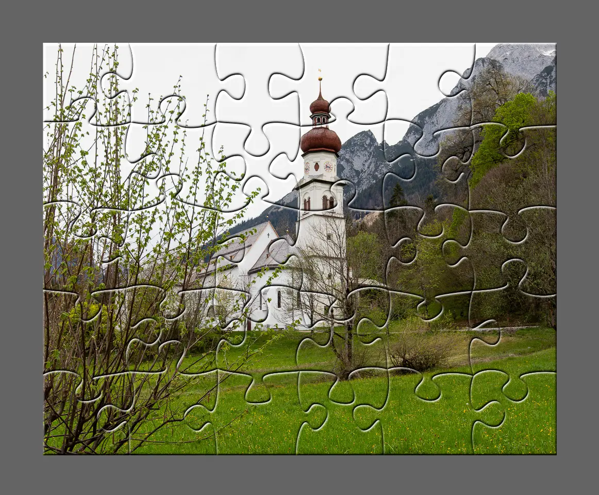
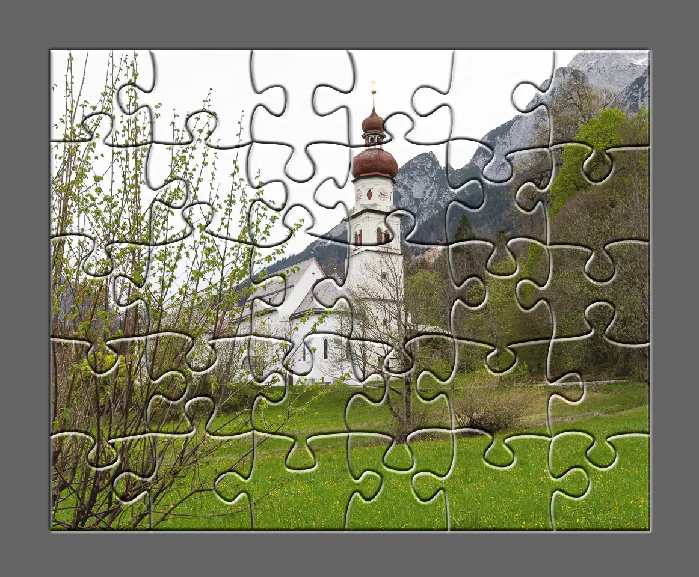
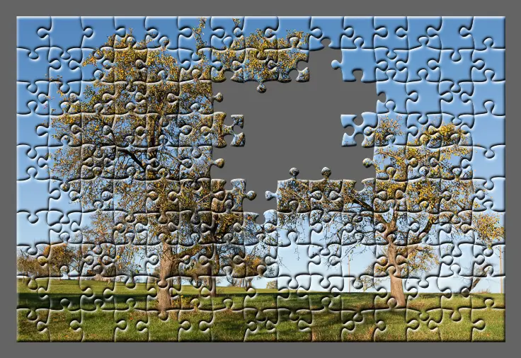
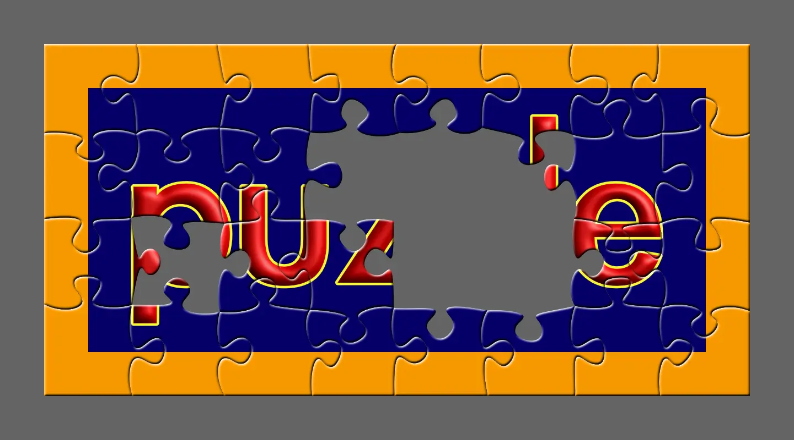

# Make a Puzzle

<div align="center">

</div>
<br/>

This script turns a photo into a puzzle by breaking it into pieces. It can also put the pieces back together to make a new image. Additionally, the script can create a simple animation that shows the puzzle being built step by step. 

The puzzle pieces can be given a more realistic, three-dimensional look by adjusting an ImageMagick script that enables the bevel design of the individual pieces.

This tool is great for fun and educational projects.

# Requirements

## Requirements for Running Natively

### Python

    python3 --version
    Python 3.12

### Pip

    pip3 --version
    pip 24.0

### Python libs

    pip3 install -U scipy --break-system-packages
    pip3 install -U matplotlib --break-system-packages
    pip3 install -U pillow --break-system-packages

### Zsh

Required with options `--pz` and `-an`

    zsh --version
    zsh 5.9 (x86_64-apple-darwin23.0)

### Others

Required with animation (option `-an`) and assembling the puzzle (option `--pz`)

#### Imagemagick®

[See Reference ImageMagick®](#imagemagick)

#### WebP `cwebp` `webpmux`

[See Reference Webp](#webp)

#### APNG `apngasm`

[See Reference APNG](#apng)

## Requirements for Running in Docker

Docker version 26.0.0

# Run

The entire output is saved in a temporary folder like `tmp_20231106132717`.

Output is:
- all the puzzle pieces `img_puzzle_<nr>.png` (optional) 
- all the puzzle pieces with bevel effect `img_puzzle_<nr>_bevel.png` (optional)
- all the puzzle piece masks `puzzle_<nr>.png`
- the assembled photo and animation `done_puzzle.png` (optional)
- the animation `done_puzzle.webp.png` or `done_puzzle.apng.png` (all optional)

## Usage

Command

    python PlayPuzzle.py --help

Output (e.g.)

    usage: PlayPuzzle [-h] [-v] [-c {k,b,r}] [-f {png,svg}] [-ot] [-cb] [-an {apng,webp}] [--pz <[0..100]>] [--ep <integer>]
        [--seed <integer>] [--width <integer>] [--height <integer>] [--dpi <integer>] [--minparts <integer>]
        [--maxparts <integer>] [--photo <file-path>]

    Create puzzle piece masks and/or create puzzle pieces from a photo and make a new photo from the puzzle pieces.

    options:
    -h, --help            show this help message and exit
    -v, --version         show program's version number and exit
    -c {k,b,r}            fill colour (Default: "k = black")
    -f {png,svg}          format (Default: "png")
    -ot                   save puzzle pieces in the subdirectory according to type
    -cb                   script is interrupted to allow manual design of the beveling
    -an {apng,webp}       animate puzzle game with given format
    --pz <[0..100]>       make a new photo with percentage of puzzle pieces. 0 = no photo, 100 = complete puzzle
    --ep <integer>        try to create equal puzzle pieces
    --seed <integer>      initial random seed
    --width <integer>     photo width
    --height <integer>    photo height
    --dpi <integer>       photo dpi value
    --minparts <integer>  minimum number of puzzle pieces
    --maxparts <integer>  maximum number of puzzle pieces
    --photo <file-path>   photo file

    Example: PlayPuzzle.py --minparts 30 --maxparts 40 --seed 35 --photo photoA.jpg --pz

## Using with Docker

To use this application with Docker, follow these instructions:

### Building the Docker Image

To build the Docker image, run the following command in the directory containing the Dockerfile:

    docker buildx build --tag puzzle .

This command builds a Docker image named puzzle.

### Running the Application in Docker

To run the application using Docker, you can mount the current directory to the `/app` directory in the container. This allows the container to access and write files to your host directory. Use the following command to run the application:

    docker run -it -v .:/app --rm puzzle --help

This command runs the puzzle Docker container, showing the help information as it would when running the application natively. Any command line arguments applicable to `PlayPuzzle.py` can be used after the image name.

## Version

Command

    python PlayPuzzle.py --version

Output (e.g.)

    PuzzleBoard v1.1.7

## Example A

Make a puzzle with a default number of pieces (minimum 25 and maximum 40). Blue masks. An initial seed for the random design of the puzzle pieces.

### Apply ImageMagick® beveling:

    python PlayPuzzle.py --photo photoF.jpg --pz 100 --seed 43 -c b

    Puzzle piece width-to-height ratio: 1.0416666666666665
    Make a puzzle with 30 (6x5) parts!
    Play puzzle

<div align="center">
<br/>

<div align="center">
    Photo: 1000 x 800 Pixel. Bevel Effects: ImageMagick®
</div>
</div>

### Apply manual beveling:

Command

    python PlayPuzzle.py --photo photoF.jpg --pz 100 --seed 43 -c b -cb

Output

    Puzzle piece width-to-height ratio: 1.0416666666666665
    Make a puzzle with 30 (6x5) parts!
    Play puzzle
    >>> Add custom bevel effects on img_puzzle_*.png in ./tmp_/app/tmp_<timestamp> now and then press <ENTER>.

 See [apply a bevel design](#apply-a-bevel-design).

<div align="center">
<br/>

<div align="center">
    Photo: 1000 x 800 Pixel. Bevel Effects: Affinity Photo® Macro
</div>
</div>

### Example A with Docker

Run the following command in the directory containing the Dockerfile:

### Apply ImageMagick® beveling:

    docker run -it -v .:/app --rm puzzle --photo photoA.jpg --pz 100 --seed 43 -c b

### Apply manual beveling:

    docker run -it -v .:/app --rm puzzle --photo photoA.jpg --pz 100 --seed 43 -c b -cb

 See [apply a bevel design](#apply-a-bevel-design).

## Example B

Make a puzzle with minimum 20 and maximum 30 pieces. Black masks (default). An initial seed for the random design of the puzzle pieces.

### Apply ImageMagick® beveling:

Command

    python PlayPuzzle.py --minparts 20 --maxparts 30 --photo photoA.jpg --pz 100 --seed 33

Output

    Puzzle piece width-to-height ratio: 1.0
    Make a puzzle with 20 (5x4) parts!
    Play puzzle

<div align="center">
<br/>

<div align="center">
    Photo: 1000 x 800 Pixel. Bevel Effects: ImageMagick®
</div>
</div>

### Apply manual beveling:

Command

    python PlayPuzzle.py --minparts 20 --maxparts 30 --photo photoA.jpg --pz 100 --seed 33 -cb

Output

    Puzzle piece width-to-height ratio: 1.0
    Make a puzzle with 20 (5x4) parts!
    Play puzzle
    >>> Add custom bevel effects on img_puzzle_*.png in ./tmp_/app/tmp_<timestamp> now and then press <ENTER>.

 See [apply a bevel design](#apply-a-bevel-design).

<div align="center">
<br/>

<div align="center">
    Photo: 1000 x 800 Pixel. Bevel Effects: Affinity Photo® Macro
</div>
</div>

### Example B with Docker

Run the following command in the directory containing the Dockerfile:

    docker run -it -v .:/app --rm puzzle --minparts 20 --maxparts 30 --photo photoA.jpg --pz 100 --seed 33

### Apply manual beveling:

    docker run -it -v .:/app --rm puzzle --minparts 20 --maxparts 30 --photo photoA.jpg --pz 100 --seed 33 -cb

 See [apply a bevel design](#apply-a-bevel-design).

## Example C

Make a puzzle with minimum 200 and maximum 230 pieces. Black masks (default).

### Apply ImageMagick® beveling:

Command

    python PlayPuzzle.py --minparts 200 --maxparts 230 --photo photoB.jpg --pz 100

Output

    Puzzle piece width-to-height ratio: 1.000250062515629
    Make a puzzle with 216 (18x12) parts!
    Play puzzle

<div align="center">
<br/>

<div align="center">
    Photo: 2000 x 1333 Pixel. Bevel Effects: ImageMagick®
</div>
</div>

### Apply manual beveling:

Command

    python PlayPuzzle.py --minparts 200 --maxparts 230 --photo photoB.jpg --pz 100 -cb

Output

    Puzzle piece width-to-height ratio: 1.000250062515629
    Make a puzzle with 216 (18x12) parts!
    Play puzzle
    >>> Add custom bevel effects on img_puzzle_*.png in ./tmp_/app/tmp_<timestamp> now and then press <ENTER>.

 See [apply a bevel design](#apply-a-bevel-design).

<div align="center">
<br/>

<div align="center">
    Photo: 2000 x 1333 Pixel. Bevel Effects: Affinity Photo® Macro
</div>
</div>

### Example C with Docker

Run the following command in the directory containing the Dockerfile:

### Apply ImageMagick® beveling:

    docker run -it -v .:/app --rm puzzle --minparts 200 --maxparts 230 --photo photoB.jpg --pz 100

### Apply manual beveling:

    docker run -it -v .:/app --rm puzzle --minparts 200 --maxparts 230 --photo photoB.jpg --pz 100 -cb

 See [apply a bevel design](#apply-a-bevel-design).

## Example D

Make a puzzle with minimum 150 and maximum 200 pieces. Only play the game for 90% and create an `apng`` animation.

Command

    python PlayPuzzle.py --minparts 150 --maxparts 200 --photo photoC.jpg --pz 90 -an apng

Ouput

    Puzzle piece width-to-height ratio: 0.9992862241256244
    Make a puzzle with 150 (15x10) parts!
    Play puzzle
    ...
    saving /app/tmp_<timestamp>/done_puzzle.apng.png (frame 135 of 135)
    all done

<div align="center">
<br/>

<div align="center">
    Photo: 700 x 467 Pixel.
</div>
</div>
<div align="center">
<br/>

<div align="center">
    Photo: 700 x 467 Pixel. APNG Animation. 90% completed
</div>
</div>

### Example D with Docker

Run the following command in the directory containing the Dockerfile:

    docker run -it -v .:/app --rm puzzle --minparts 150 --maxparts 200 --photo photoC.jpg --pz 90 -an apng

## Example E

Make 80% of the puzzle

Command

    python PlayPuzzle.py --minparts 30 --maxparts 200 --photo photoE.png --pz 80

Output

    Puzzle piece width-to-height ratio: 1.0
    Make a puzzle with 32 (8x4) parts!
    Play puzzle


<div align="center">
<br/>

<div align="center">
    Photo: 1280 x 640 Pixel.
</div>
</div>

### Example E with Docker

Run the following command in the directory containing the Dockerfile:

    docker run -it -v .:/app --rm puzzle --minparts 30 --maxparts 200 --photo photoE.png --pz 80

# Customize

## bevel.zsh

The [bevel.zsh](./bevel.zsh) script acts as a “hook” that is called after the puzzle pieces have been created. It is used to apply a bevel to the “flat” pieces, giving them a more three-dimensional appearance. Users can customize the bevel design by modifying the [bevel.zsh](./bevel.zsh) script.

The beveling in [bevel.zsh](./bevel.zsh) is performed using one of two functions, depending on the options selected:

`custom_bevel ()`: This function is invoked if the `-cb` option is used. It is designed not to be modified by the user. Instead, it serves to pause the script, allowing the user to manually apply a bevel design to the flat puzzle pieces using image processing software like Affinity Photo® ([See Apply a bevel design](#apply-a-bevel-design)). The script resumes when the user presses `<ENTER>` after completing the manual adjustments. Please keep in mind that more commands may have a big impact on the runtime of the script.

`imagemagick_bevel ()`: This function is used if the `-cb` option is not set. It applies the bevel using ImageMagick® commands, which users can adjust to suit their preferences. The function includes commands that can be modified or new commands can be added for further customization. 

### Example

Original code:

```zsh
imagemagick_bevel ()
{
    for png_file in "$tsdir"/**/img_puzzle_*.png; do
        local file_path_base_name="${png_file:r}"
        local out_file="${file_path_base_name}_bevel.png"

        magick "$png_file" -alpha extract "${file_path_base_name}_mask.png"

        magick "${file_path_base_name}_mask.png" \( +clone -blur 0x2 -shade 120x20 -contrast-stretch 0% +sigmoidal-contrast 2x50% -fill grey70 -colorize 10%  \) +swap -alpha Off -compose CopyOpacity -composite "${file_path_base_name}_overlay.png"

        magick "${png_file}" "${file_path_base_name}_overlay.png" -compose Hardlight -composite "${file_path_base_name}_bevel.png"

        rm "${file_path_base_name}_mask.png" "${file_path_base_name}_overlay.png"
    done
}
```

Modified code:

```zsh
imagemagick_bevel ()
{
    for png_file in "$tsdir"/**/img_puzzle_*.png; do
        local file_path_base_name="${png_file:r}"
        local out_file="${file_path_base_name}_bevel.png"

        magick "$png_file" -alpha extract "${file_path_base_name}_mask.png"

        magick "${file_path_base_name}_mask.png" \( +clone -blur 0x3 -shade 120x20 -contrast-stretch 0% +sigmoidal-contrast 2x50% -fill grey50 -colorize 10%  \) +swap -alpha Off -compose CopyOpacity -composite "${file_path_base_name}_overlay.png"

        magick "${png_file}" "${file_path_base_name}_overlay.png" -compose Hardlight -composite "${file_path_base_name}_bevel.png"

        rm "${file_path_base_name}_mask.png" "${file_path_base_name}_overlay.png"
    done
}
```

See https://usage.imagemagick.org/transform/#shade_blur for more information about customization options.
 
Hence [bevel.zsh](./bevel.zsh) setup provides flexibility, enabling users to either quickly apply a standardized bevel or to create a custom look by adjusting the script or using external tools.

### Apply a bevel design

How to use the Affinity Photo® [Puzzle3D.afmacro](./Puzzle3D.afmacro):

1. **Import the Macro**:

- Open a new docuement with Affinity Photo® and access the Macro panel by navigating to View > Studio > Macros.
- In the Macros panel, select the tab `Macro` and click on the import icon 
     and select your `Puzzle3D.afmacro` file. The macro should now be visible in the Tab `Library`:
<div align="center">
<br/>


<br/>

</div>
<br/>

2. **Prepare for Batch Processing**:
   - Go to File > New Batch Job. This opens a new window for batch processing.
   - Click on “Add” to browse through and select the images in your `./puzzles` directory that you wish to process. Alternatively, if supported, you can drag and drop the folder directly into the window.
3. **Apply Macro in Batch Processing**:
   - In the "Macros" section within the batch processing window, you should be able to select the previously imported `Puzzle3D` macro. Click on it to select it.
   - Ensure the checkbox next to the macro name is checked to activate it for batch processing.
4. **Set Output Options**:
   - In the “Output” section, choose your preferred location for the processed images. You might >want to specify a new folder to avoid overwriting the original images.
   - Decide on the format in which you want the processed images to be saved, such as JPEG, PNG, etc.
5. **Start Batch Processing**:
   - Once everything is set up, click on “Apply” to start the batch processing. Affinity Photo® will now process each image in the selected folder with your `Puzzle3D` macro.

<div align="center">
<br/>

</div>
<br/>

Depending on the number and size of the images, the batch processing might take some time. Monitor the progress and, after completion, check some of the processed images to ensure the macro has been applied as expected.

# References

## ImageMagick

- https://imagemagick.org

### ImageMagick - Bevel

- https://usage.imagemagick.org/transform/#shade_blur

## Affinity Photo

- https://affinity.serif.com

## Webp

- https://developers.google.com/speed/webp/docs/cwebp

- https://developers.google.com/speed/webp/docs/webpmux

## APNG

- https://apngasm.sourceforge.net

- https://github.com/apngasm/apngasm

## OpenCV

- https://opencv.org
